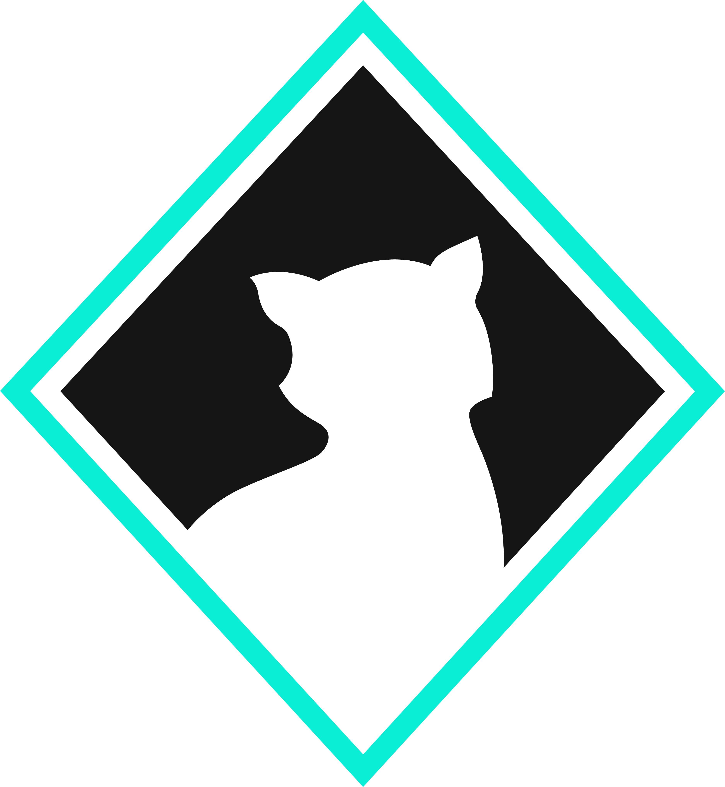

# CatHouse 4.1

<div align="center">

</div>


## **Instalação**

### **Criando env** _"opcional"_
```
python3 -m venv cathouse-env
```
E para ativar o env:
```
source cathouse-env/bin/activate
```

### **Dependências**
A instalação das dependências do projeto pode ser feita através do comando abaixo, utilizando o arquivo requirements.txt deste repositório.
```
pip install -r requirements.txt
```

### **Git clone**
Realize o clone deste repositório GIT com o comando abaixo, dentro da sua pasta de APPs no seu pojeto Django.
```
git clone https://github.com/douglas-vitor/cathouse.git
```

### **Criando o projeto django**
Estando dento do diretório do repositório clonado utilize o comando abaixo:
```
django-admin startproject ch4_1 .
```

### **Settings.py**
Vá para o diretório ch4_1 e altere o _settings.py_ ; dentro da lista INSTALLED_APPS, adicione o App 'ch_app' .
No fim deste mesmo arquivo adicione as seguintes linhas:
```
STATIC_URL = '/ch_app/static/'

LOGIN_REDIRECT_URL = 'home'
```
Então salve e feche o arquivo.

### **urls.py**
Ainda no diretório ch4_1 abra o arquivo _urls.py_ para realizar as seguintes modificações.
Adicione o seguinte import:
```
from django.urls import include
```
Na lista urlpatterns, adicione o seguinte path:
```
path("", include('ch_app.urls')),
```
Salve e feche este arquivo.

### **Migrate**
Vá para a raiz do projeto e então realize o primeiro migrate do seu projeto com o comando abaixo:
```
python3 manage.py migrate
```

### **Cria super usuario**
Agora com o comando a seguir crie um usuário para ter acesso ao App.
```
python3 manage.py createsuperuser
```

### **Sincronizar banco de dados**
Sincronize o banco de dados com as tabelas do nosso App.
```
python3 manage.py migrate --run-syncdb 
```

### **Iniciando o sevidor**
Agora execute o comando a baixo para iniciar o servidor para poder testar o App.
```
python3 manage.py runserver
```
